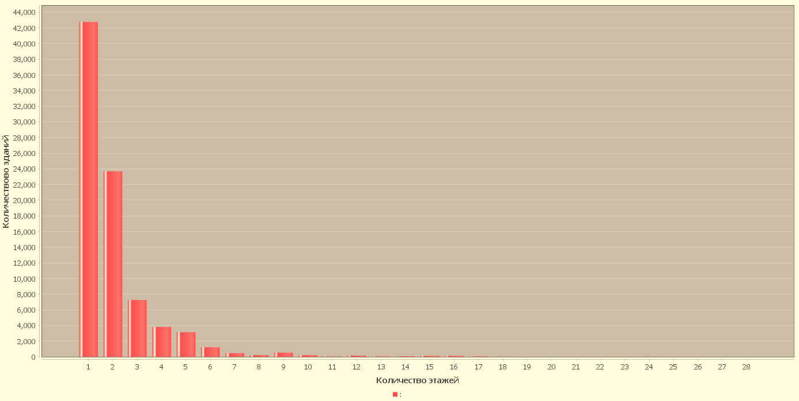
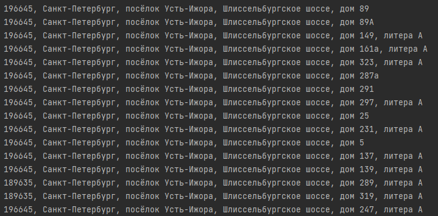
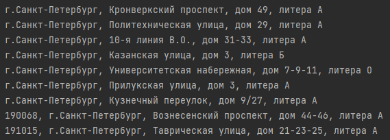
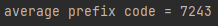

Задание 1) Создаем график количества домов с определенным количеством этажей

Задание 2) Находим зарегестрированные участки, по улице шлиссельбургское шоссе с префиксом 9881

задание 3) Находим "университеты" выше 5 этажа с известным годом постройки

находим средний prefix_code

Последовательность работы по проекту:

Для начала нам нужно распарсить base.csv, для этого пишем TableParser, используя библиотеку CSVReader. Генерируем таблицу Sql с помощью класса SqlGenerator.
Из данных полученных при парсинге. Для решения задач используем sql простые запросы. Для генерации таблицы в первом номере используем библиотеку JFreeChart.Генерируем таблицу Sql. Выполняем задания используя простые sql запросы из базы данных.
